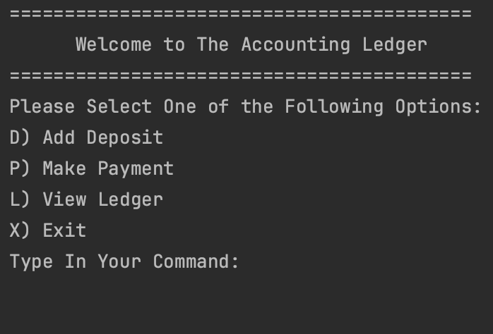
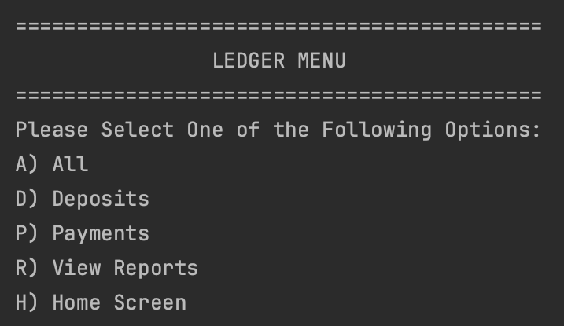
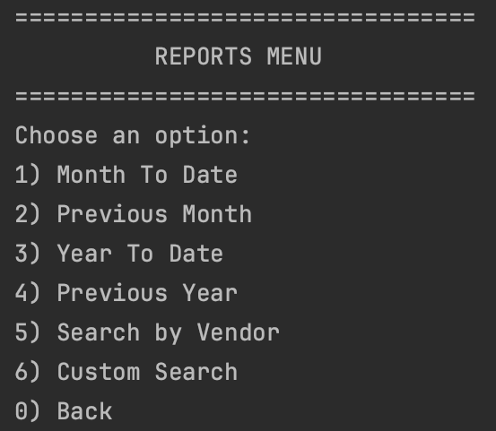
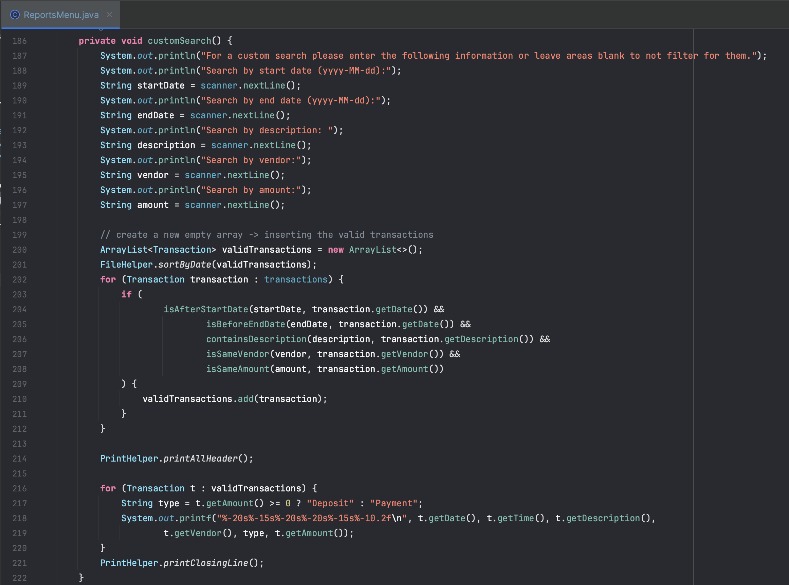
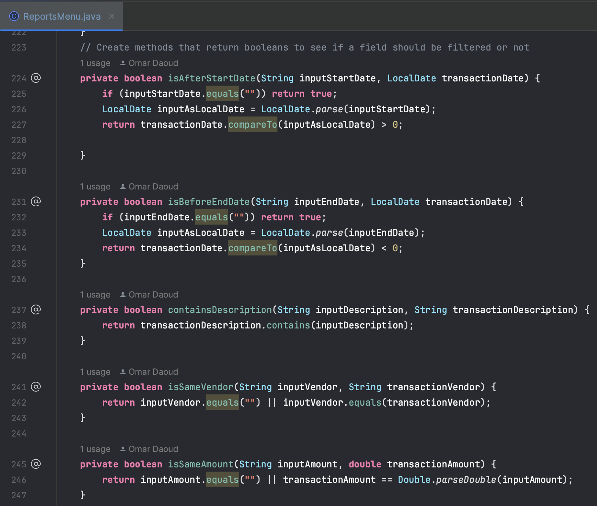

# AccountingLedger README

AccountingLedger is a simple Java application that allows users to manage transactions in an accounting ledger. Users can add deposits and payments, view the ledger, and generate various reports based on transaction data. The application provides a command-line interface for user interaction.

## Table of Contents
- [Features](#features)
- [Usage](#usage)
- [Unique Code](#unique-code)

## Features
- **Add Deposit**: Users can add deposits with specific date, time, description, vendor, and amount.
- **Make Payment**: Users can record payments with similar details as deposits, but the amount is represented as negative.
- **View Ledger**: Users can view the ledger, which displays all transactions including date, time, description, vendor, type, and amount.
- **Generate Reports**: Users can generate various reports, such as Month To Date, Previous Month, Year To Date, Previous Year, transactions by a specific vendor, and custom search based on filters like start date, end date, description, vendor, and amount.

## Usage

1. **Main Menu**: Upon running the application, you'll be presented with the main menu where you can choose different options as shown below:
   

2. **Add Deposit**:
   - Enter date and time (yyyy-MM-dd) or leave empty for the current date/time.
   - Enter description, vendor, and amount for the deposit.
   

3. **Make Payment**:
   - Enter date and time (yyyy-MM-dd) or leave empty for the current date/time.
   - Enter description, vendor, and amount for the payment. The amount should be entered as negative.
   

4. **View Ledger**:
   - In the ledger menu, you can choose different options to view transactions, deposits, payments, view reports, and return to the main menu.
   

5. **Generate Reports**:
   - Choose specific options to generate reports based on different criteria, such as time periods, vendors, and custom searches.
   

## Unique Code

A particular piece of code I found unique to create was the custom search method. This method prompts the user for information on which fields to filter the transactions Array List. I was able to achieve this by creating multiple methods that returned booleans for each input field and using those within the custom search.
